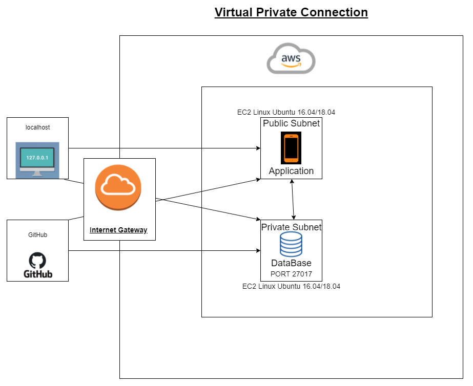

# Cloud Computing

## Table of Contents

- [Cloud Computing](#cloud-computing)
  - [Table of Contents](#table-of-contents)
  - [Types](#types)
  - [Benefits](#benefits)
    - [What is AWS?](#what-is-aws)
    - [AWS Region](#aws-region)
    - [EC2](#ec2)
    - [Migrating to cloud](#migrating-to-cloud)
    - [Steps](#steps)
    - [Deploy](#deploy)
    - [Create DB EC2 Instance](#create-db-ec2-instance)

## Types

- Public (AWS)
- Private (Local Machines)
- Hybrid (Mostly used in FinTech)

## Benefits

- Reduces IT Costs
- It is very Scalable
- Collaboration efficiency
- Flexibility of work practices
- Access to automatic updates
- More reliable and secure

### What is AWS?

AWS is a comprehensive, evolving cloud computing platform provided by Amazon.

### AWS Region

- Check this link for and [overview](https://aws.amazon.com/about-aws/global-infrastructure/?p=ngi&loc=1).
- Region for us is Europe.
- Minimum two availability zones.
- Orange zones are coming soon, blue zones are already functioning.

### EC2

- Stands for `Elastic Compute Service`
- Create, Required Compute POWER/SERVICE/VM
- Used on Windows/Linux/Amazon

### Migrating to cloud

- We need to decide which machines we need to look for in the EC2 Instance. In our case Linux Ubuntu 16.04 (upgraded to) 18.04.
- Set up Machine with required dependencies.
- Expose required ports (allow in security group).
- Enable public ip.

### Steps

- Go to EC2
- Click `Launch Machine`
- Choose `Ubuntu Server 18.04 LTS (HVMI)` with `x86`
- Click next
- Select Default Subnet 1a.
- Enable public IP.
- `Next` x3.
- Add a `NAME` of `ENG103A_TUDOR` then NEXT
- Add security group named `eng103a_tudor` and add the same for description
- Add ip, `my ip` and description 'my ip only' and click next
- Choose the correct key pair
- Launch you instance
- Allow HTTP port 80 to be able to check nginx website.
- Connect to your EC2 instance `ssh -i "eng103a.pem" ubuntu@ec2-3-250-104-55.eu-west-1.compute.amazonaws.com`.

### Deploy

- Use this command to sync local folders to ec2 instance `scp -i "~/.ssh/eng103a.pem" -r app ubuntu@ec2-34-240-156-151.eu-west-1.compute.amazonaws.com:~`.
- To make sure you can access your app on the required port you need to allow that specific port. In our case, this port is port 3000.
- You can install apps and packages just like in a regular VM.

### Create DB EC2 Instance

- Create another EC2 instance for `mongodb`.
- Setup/install mongodb required version.
- Changed `mongo.conf` to allow app access.
- Allowed all ports in Security tab. In production only the app ip HAS to be allowed.
- Allowed port 27017 and public ip of the app
- Created env var in `~/.bashrc` `export DB_HOST=mongodb://18.203.237.207:27017/posts`
- Seeded the db with `node ~/app/seeds/seed.js`
- Started the app with `npm run start`
