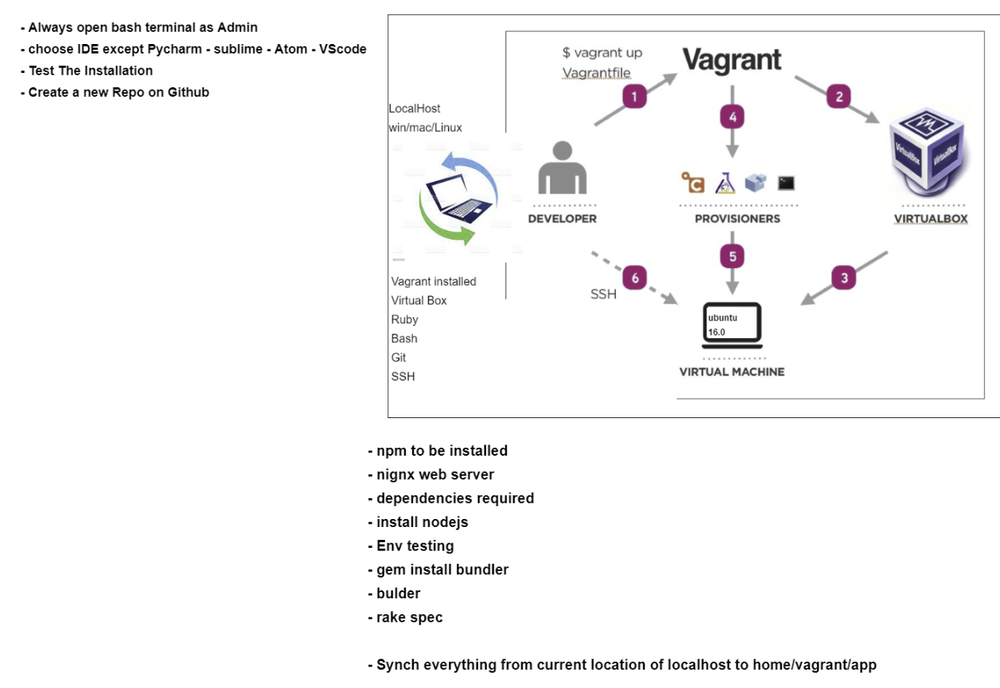

# What is DevOps

## Why DevOps?- [What is DevOps](#what-is-devops)

- [What is DevOps](#what-is-devops)
  - [Why DevOps?- What is DevOps](#why-devops--what-is-devops)
    - [Monolith 2 tier & Microservices Architectures](#monolith-2-tier--microservices-architectures)
  - [Virtualisation with Vagrant](#virtualisation-with-vagrant)
  - [Installing dependencies and creating first VM on Windows](#installing-dependencies-and-creating-first-vm-on-windows)
    - [Step 1 _Install Ruby_](#step-1-install-ruby)
    - [Step 2 _Install Vagrant_](#step-2-install-vagrant)
    - [Step 3 _Install Virtualbox_](#step-3-install-virtualbox)
    - [Step 4 _Add the vagrant file_](#step-4-add-the-vagrant-file)
    - [Run your VM](#run-your-vm)
    - [Update and install packages in VM](#update-and-install-packages-in-vm)
    - [Useful commands](#useful-commands)
    - [Linux Basics](#linux-basics)
    - [Bash scripting](#bash-scripting)
    - [Automate updates, upgrades and install of nginx](#automate-updates-upgrades-and-install-of-nginx)
    - [Add provision file file and](#add-provision-file-file-and)
    - [Questions to ask DEV team before deploying](#questions-to-ask-dev-team-before-deploying)
    - [Install and run spec tests](#install-and-run-spec-tests)
    - [Linux Variables](#linux-variables)
    - [Environment Variables](#environment-variables)
    - [Reverse Proxy (with Nginx)](#reverse-proxy-with-nginx)

**Four pillars of DevOps best practice**

- Ease of Use
- Flexibility
- Robustness - faster delivery of product
- Cost - cost effective (by automating the process, creating CI/CD pipelines)

### Monolith 2 tier & Microservices Architectures

## Virtualisation with Vagrant



## Installing dependencies and creating first VM on Windows

### Step 1 _Install Ruby_

- Go to this link and download **Ruby** `https://github.com/oneclick/rubyinstaller2/releases/download/RubyInstaller-2.6.6-1/rubyinstaller-devkit-2.6.6-1-x64.exe`

- To check if Ruby is installed correctly, run `ruby --version` in your terminal. If it returns a version it means that Ruby is correctly installed on your machine.

### Step 2 _Install Vagrant_

- Install Vagrant by clicking on [this link](https://www.vagrantup.com).
- Check vagrant version by typing `vagrant --version` in your terminal.
- To view a list of commands, type in `vagrant` in your terminal.

### Step 3 _Install Virtualbox_

- Install Virtualbox by clicking on [this link](https://www.virtualbox.org/wiki/Downloads) and, from **"VirtualBox 6.1.32 platform packages"** choose `Windows hosts`.
- Install everything that you are being asked to.
- Navigate to `C:\Program Files\Oracle\VirtualBox\drivers\vboxdrv`
- Right click on the VBoxDrv.inf Setup Information file and and select Install
- When it's finished installing, open up a new terminal window and run `sc start vboxdrv`
- Press the Windows Key and search for Control Panel, go from there to Network and Internet, then Network and Sharing Centre, then Change Adapter Settings.
- Right click on VirtualBox Host-Only Network and choose Properties
- Click on Install => Service
- Under Manufacturer choose Oracle Corporation and under Network Service, choose VirtualBox NDIS6 Bridged Networking driver

### Step 4 _Add the vagrant file_

- This file `needs` to be in the folder that you're running the VM from
- Use `nano vagrantfile` and add this block of code:

```
Vagrant.configure("2") do |config|

 config.vm.box = "ubuntu/xenial64"
# creating a virtual machine ubuntu


end
```

### Run your VM

- To run the VM, `cd` into your parent folder (the one that holds the `Vagrant` file) and run `vagrant up`
- To check the status use `vagrant status`
- To go into your VM do `vagrant ssh`

You should now be in you (in this case) Linux Virtual Machine

### Update and install packages in VM

For Linux Ubuntu Distro, you can use several commands to update and install packages or check the status of different processes

- `sudo apt-get update` downloads and installs available updates
- `sudo apt-get upgrade` upgrades all packages that have available upgrades
- `sudo apt-get install <package-name>` installs the specified package
- `systemctl status <app-name>` returns the status for the specified app
- `exit` will exit the Virtual Machine
- use `-y` when installing or upgrading/updating packages to automatically confirm everything

### Useful commands

- `vagrant up` creates a VM
- `vagrant status` displays the status of the machine
- `vagrant destroy` deletes the VM
- `vagrant halt` pauses the VM
- `vagrant reload` updates the VM (for example when you update the vagrant file)
- `vagrant ssh` enter the VM

### Linux Basics

- `uname` finds out the name of the machine. Add `-a` flag to add extra info with the name.
- `pwd` displays the path to current folder.
- `ls` lists directories/files. Add the `-al` flag to format the nicely when displayed and displays the hidden folder/files.
- `mkdir <directory-name>` make directory.
- `cd <name of directory>` changes the directory. If you don't specify the name of the folder, it will return you to the root folder.
- `touch <file-name>` creates a file.
- `nano <file-name>` creates a text file using nano.
- `cat <file-name>` displays the content of the file.
- `rm -rf <file-name>` removes the specified filename.
- `cp <file-destination-name> <final-destination>` copies the specified file to the specified destination.
- `mv <file-name(with path if necessary)> <destination-filepath>` moves a certain file to a specified folder.
- `top` check running processes

### Bash scripting

- READ Write Executable read-only.
- To check permissions `ll`.
- `chmod <permission> <file-name>` to change permission.
- When you make a file executable, it is good practice to make it read-only.

### Automate updates, upgrades and install of nginx

- create `provision.sh` file
- add this block of code inside `provision.sh`:

  ```
  #!/bin/bash

  # run updates
  sudo apt-get update -y

  # run upgrades
  sudo apt-get upgrade -y

  # install nginx
  sudo apt-get install nginx -y
  ```

  This will ask Linux to install the updates, upgrade the files and install nginx.

- Make `provision.sh` executable by typing `chmod +x provision.sh`. This gives the file `executable permission`
- run `provision.sh` file by typing in the terminal `sudo provision.sh`

### Add provision file file and

**All commands that need to be run when creating the VM (such as updates, upgrades, installing dependencies need to be added to this file. This will run them when the VM is created.)**

- create a folder called `src` in the same location that the `vagrant` file is in.
- add a `provision.sh` file inside the `src` folder.
- add the next code snippet inside the `provision.sh` file to update, upgrade and install nginx:

  ```
  #!/bin/bash

  # run updates
  sudo apt-get update -y

  # run upgrades
  sudo apt-get upgrade -y

  # install nginx
  sudo apt-get install nginx -y
  ```

- add the next block of code in your `vagrantfile` file to add current folder in the VM when creating it.

  ```
  # sync folder       , localhost path, path for vm
  config.vm.synced_folder ".", "/home/vagrant/code"

  # sync and run provision file
  config.vm.provision "shell", path: "./src/provision.sh"
  ```

- to update VM with the provisioned commands, stop the VM and restart it with `vagrant up --provision`. When you create a new vm with a `provision script`, you do not need the `--provision` flag.

### Questions to ask DEV team before deploying

- What dependencies are required?
- Which operating system/platform can it be tested and deployed on?
- Which port do we need to allow?
- What hardware specs do we need to run it on?

### Install and run spec tests

- In the spec-tests folder, when you run the tests, it will show you a list of dependencies that the app will need to run. You can install and add them to the `provision.sh` file so they are being installed automatically when the VM is created.
- `cd` into the parent directory, the one containing the `environment` folder.
- `cd` into spec-tests.
- type `gem install bundler` to install `bundler` package manager (similar with `pip` for python).
- `bundle` will install all of the requirements for running the specs tests with Ruby.
- `rake spec` from this location to run the tests. This will return the dependencies needed for the app.
- Install all of the dependencies missing in your VM and run the `rake spec` command in your other terminal to make sure that all of the spec tests are passing.

### Linux Variables

- Create Linux variable using this command in the terminal `FIRST_NAME=TUDOR`. This env var is not permanent.
- How to check the var `echo $<KEYNAME>` for example, `echo $FIRST_NAME`.

### Environment Variables

- How to check `environment variables`.
- Command: `printenv key` to print specific env var or `env` to list all env variables.
- Create env var with using the `export` command. Ex: `export FIRST_NAME=TUDOR`.
- How to make env var persistent: In your `.bashrc` file, use this to create a persistent variable: `export <VARIABLE_NAME>=<VARIABLE_VALUE>`. Then do `source ~/.bashrc` to reload the .bashrc file without restarting the VM.
- `unset <ENV_NAME>` to delete the specific env variable.
- How to kill a Linux process: `top` to view all processes and then `sudo kill <process-id>`.
- How to use `grep` & | ------- example: `env | grep HOME`.

### Reverse Proxy (with Nginx)

- Follow this link to create a reverse proxy with nginx: [Digital Ocean Guide](https://www.digitalocean.com/community/tutorials/how-to-set-up-a-node-js-application-for-production-on-ubuntu-16-04#step-3-installing-pm2)
- If `pm2` throws an error, use this command to download the compatible version of `pm2`: `sudo npm install -g pm2@^3`.
- Make sure the port you are running your app on is not used by some other app `sudo lsof -iTCP -sTCP:LISTEN -P`
- After editing the appropriate file with `sudo nano /etc/nginx/sites-available/default` make sure you check for errors in nginx with `sudo nginx -t`, restart the service with `sudo systemctl restart nginx` and check it's status with `sudo systemctl status nginx`
