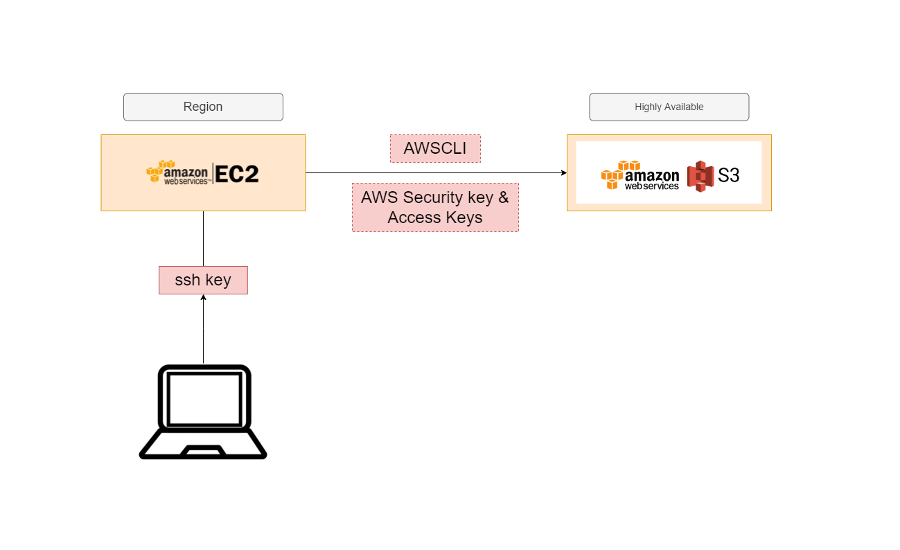

# Amazon S3 Bucket

# Table of Contents

- [Amazon S3 Bucket](#amazon-s3-bucket)
- [Table of Contents](#table-of-contents)
  - [What is Amazon S3](#what-is-amazon-s3)
  - [Advantages](#advantages)
  - [Use Cases](#use-cases)
  - [S3 Storage Classes (WIP)](#s3-storage-classes-wip)
  - [Steps to Log into S3](#steps-to-log-into-s3)

## What is Amazon S3

Amazon Simple Storage Service (Amazon S3) is an object storage service that offers industry-leading scalability, data availability, security, and performance. Customers of all sizes and industries can use Amazon S3 to store and protect any amount of data for a range of use cases, such as data lakes, websites, mobile applications, backup and restore, archive, enterprise applications, IoT devices, and big data analytics. Amazon S3 provides management features so that you can optimize, organize, and configure access to your data to meet your specific business, organizational, and compliance requirements.

## Advantages

- Globally available.
- Can Store anything.
- Reliable Security.
- Low cost.
- Ease of Migration.
- Simplicity of Management.

## Use Cases

- Used for Disaster Recovery.
- We can perform the CRUD operations (Create, Read, Update, Delete).
- Analytics.
- Data Archiving.
- Static Website Hosting.
- Security and Compliance.

## S3 Storage Classes (WIP)

- Standard: Access data anytime.
- Glacier: infrequent data access.
- Check more [here](https://docs.aws.amazon.com/AmazonS3/latest/userguide/storage-class-intro.html)

## Steps to Log into S3

- Run you instance.
- SSH into your instance.
- AWS CLI Dependencies: install pip3, python3.
- Use `sudo pip3 install awscli` to install AWSCLI.
- Run `aws configure`
- Input access id
- Input secret key
- Input region `eu-west-1`.
- Choose `json` as the preferred language.
- If everything is done correctly, if you type `aws s3 ls` we will get a list of files in the specified S3 bucket
