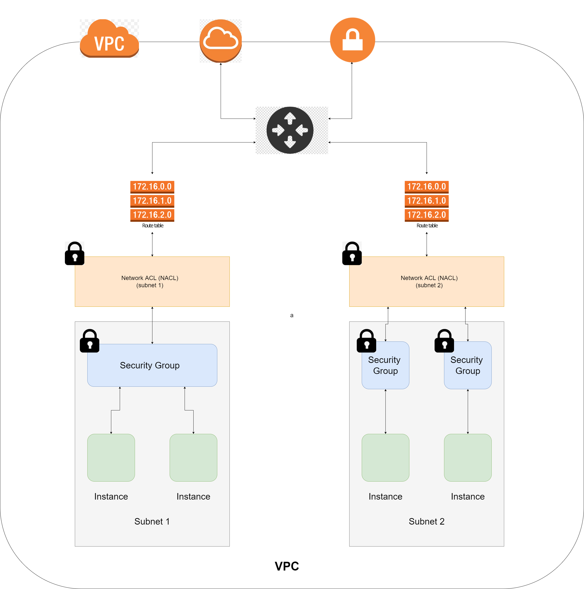

# VPC Architecture



## Table of Contents

- [VPC Architecture](#vpc-architecture)
  - [Table of Contents](#table-of-contents)
  - [What is a VPC](#what-is-a-vpc)
  - [What is a CIDR Block](#what-is-a-cidr-block)
  - [What is an Internet Gateway](#what-is-an-internet-gateway)
  - [What is Route Table](#what-is-route-table)
  - [What is NACL](#what-is-nacl)
  - [What is a Subnet](#what-is-a-subnet)
  - [Creating a VPC](#creating-a-vpc)
  - [Step-by-Step](#step-by-step)

## What is a VPC

`Amazon Virtual Private Cloud` (Amazon VPC) enables you to launch AWS resources into a virtual network that you've defined. This virtual network closely resembles a traditional network that you'd operate in your own data center, with the benefits of using the scalable infrastructure of AWS.

## What is a CIDR Block

`Classless inter-domain routing (CIDR)` is a set of Internet protocol (IP) standards that is used to create unique identifiers for networks and individual devices. The IP addresses allow particular information packets to be sent to specific computers.

## What is an Internet Gateway

An `Internet gateway` is a network "node" that connects two different networks that use different protocols (rules) for communicating. In the most basic terms, an `Internet gateway` is where data stops on its way to or from other networks. Thanks to gateways, we can communicate and send data back and forth with each other.

Routers are often Internet gateways. They are a piece of hardware that essentially connects your computer to the Internet. In home networks, it is usually something that comes with software you can install on one computer and then connect other computers to as well. Then everyone connected to your router can connect to the Internet through your ISP. While a router can be connected to more than two networks at a time, this is usually not the case for routers used at home

## What is Route Table

A route table contains a set of rules, called routes, that are used to determine where network traffic from your subnet or gateway is directed. To put it simply, a route table tells network packets which way they need to go to get to their destination.

## What is NACL

A network access control list (ACL) is an optional layer of security for your VPC that acts as a firewall for controlling traffic in and out of one or more subnets. You might set up network ACLs with rules similar to your security groups in order to add an additional layer of security to your VPC.

## What is a Subnet

A subnet is a range of IP addresses in your VPC. You can launch AWS resources, such as EC2 instances, into a specific subnet. When you create a subnet, you specify the IPv4 CIDR block for the subnet, which is a subset of the VPC CIDR block. Each subnet must reside entirely within one Availability Zone and cannot span zones. By launching instances in separate Availability Zones, you can protect your applications from the failure of a single zone.

## Creating a VPC

- Choose a region (Ireland)
- Create VPC
- Choose a valid `CIDR Block` for the VPC (10.0.0.0/16)
- Create `Internet Gateway` **AND attach** the Internet Gateway to our VPC
- Create a `Public Subnet`
- Associate subnet to VPC **AND** create route table/s for `Public Subnet`
- Edit routes to **allow** `Internet Gateway`
- Associate to our `Public Subnet`
- Create `Security Group` in our public subnet to allow required ports
- IF we are really precise, we need to `allow port 80, 3000, https - ssl`
- Subnet CIDR block for public - 10.0.1.0/24. A wrong CIDR block CAN NOT be created

- CIDR Block: 10.0.7.0/24

## Step-by-Step

- Got to vpcs
- Click on vpc
- Click `Create VPC`
- Name VPC
- For CDIR do 10.0.0.0/16
- Click `Create VPC`
- VPC is empty so create `Internet Gateway` (left hand side menu, click on internet Gateway)
- Click on Create Internet Gateway, name it `eng103a_tudor_IG` and click `create`
- Attach IG to VPC (click actions->attach to vpc-> choose your vpc)
- Create Public Subnet (Choose `Subnets` from left), click Public subnet
- Choose your VPC
- Provide name
- Choose availability zone
- Provide CDIR block `10.0.7.0/24`
- Create the Subnet
- Create route table (choose route tables from left menu)
- Click on create route table
- Name it `eng103a_tudor_RT_public`
- Choose your VPC from the drop-down and create the table
- Edit routes to allow `Internet Gateway` (From The created table, `Choose Actions`, `Edit Routes`)
- Add `Destination 0.0.0.0/0` and for the `Target` choose `Internet Gateway` and `Save Changes`.
- Go to `Actions` and choose `Edit Subnet Associations` to attach your subnets
- Select your subnets and click `Save Associations`
- Now we need a security group (either create a new one or use one that was previously created)
- Go to ec2
- Select free tier ubuntu 18
- On config instance details choose your vpc
- Do the user data at the bottom of the file
- Add the ports (ssh, http, custom 3000)

Use this snippet to install the dependencies and run the app in the app EC2 Instance

```
#!/bin/bash
sudo apt update -y && sudo apt upgrade -y
sudo su ubuntu
echo "export DB_HOST='mongodb://10.0.14.49:27017/posts'" >> /home/ubuntu/.bashrc
source /home/ubuntu/.bashrc
export DB_HOST='mongodb://10.0.14.49:27017/posts'
cd /home/ubuntu/app && screen node seeds/seed.js
cd /home/ubuntu/app && screen -d -m npm start
```
